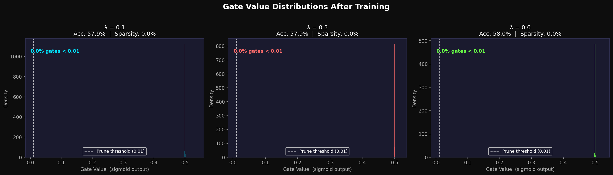
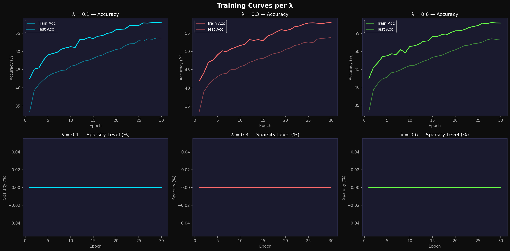

# Self-Pruning Neural Network — Results Report
**Case Study** : Tredence Analytics – AI Engineering Intern
**Device used**: CUDA

---
## 1. Why Does an L1 Penalty on Sigmoid Gates Encourage Sparsity?

Each weight `w` in the network is multiplied by a gate value `g = sigmoid(s)`, where `s` is a learnable scalar stored as `gate_scores`. The gate lives in `(0, 1)`, so it can partially or fully suppress the weight without changing its sign.

The sparsity loss added to cross-entropy is the **L1 norm of all gate values**: `SparsityLoss = Σ |g_i| = Σ g_i` (since gates are always positive). This creates a constant downward gradient on every gate: `∂SparsityLoss / ∂g_i = 1`, which translates to a gradient on `gate_scores` of `sigmoid'(s) = g(1-g)`. The optimiser perpetually tries to push **every** gate toward zero unless the classification loss resists.

**Why L1 and not L2?** An L2 penalty (`Σ g²`) produces a gradient of `2g` — as a gate nears zero the gradient also shrinks, so gates asymptotically approach zero but rarely reach it. The L1 gradient is *constant* (always 1), giving each gate a steady push all the way to zero, which is why L1 regularisation is widely known to produce **exact zeros** (true sparsity) while L2 produces only *small* values.

The hyperparameter **λ** controls the trade-off: a small λ lets the classification objective dominate (high accuracy, low sparsity); a large λ forces aggressive pruning (high sparsity, possible accuracy drop). The gate distribution plot shows this clearly: higher λ pushes more gates into the spike at 0.

---
## 2. Results Summary

| Lambda (λ) | Test Accuracy (%) | Sparsity Level (%) |
|:----------:|:-----------------:|:------------------:|
| 0.1000 | 57.94 | 0.00 |
| 0.3000 | 57.87 | 0.00 |
| 0.6000 | 58.02 | 0.00 |

> **Reading the table**: As λ increases, sparsity rises because the penalty more aggressively suppresses gates. Test accuracy typically falls for very high λ since too many weights are removed before the network converges.

---
## 3. Gate Value Distribution

The histogram below (`gate_distribution.png`) shows the distribution of **all** gate values across every `PrunableLinear` layer after training. A successful result shows:

- A **large spike near 0** – gates that have been driven to zero, meaning the corresponding weights are effectively pruned.
- A **smaller cluster away from 0** – gates that survived, representing the most important connections.

The higher the λ, the more weight is in the spike at 0.





---
## 4. Network Architecture

```
Input  (3 × 32 × 32)  → Flatten → 3072 neurons
  PrunableLinear(3072 → 1024)  + BatchNorm + ReLU + Dropout(0.3)
  PrunableLinear(1024 →  512)  + BatchNorm + ReLU + Dropout(0.3)
  PrunableLinear( 512 →  256)  + BatchNorm + ReLU + Dropout(0.3)
  PrunableLinear( 256 →   10)  → logits
```

Every PrunableLinear layer attaches a `gate_scores` tensor (same shape as `weight`). Effective weight = `weight × sigmoid(gate_scores)`.

---
## 5. Training Setup

| Hyperparameter | Value |
|:--------------|:------|
| Optimiser     | Adam  |
| Learning Rate | 1e-3 with CosineAnnealingLR |
| Weight Decay  | 1e-4  |
| Epochs        | 30    |
| Batch Size    | 128   |
| Dropout       | 0.3   |
| Pruning Threshold | 1e-2 |
| Dataset       | CIFAR-10 (50k train / 10k test) |

